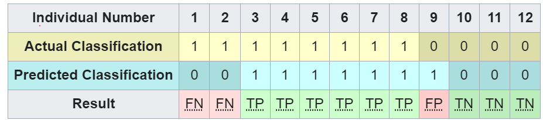

# Clinical Laboratory Stastics with R


```{r include=FALSE, warning=FALSE}
#install.packages("tidyverse")
#install.packages("ggQC")
#install.packages("caret", repos = "https://cloud.r-project.org")
#install.packages("mcr", repos = "https://cloud.r-project.org")
#install.packages("verification")
#install.packages("pROC")
#install.packages("gridExtra")
#install.packages("TTR")
#install.packages("ggpubr")
#install.packages("reshape")
#install.packages("tinytex", dependencies = TRUE)
```


```{r include=FALSE, warning=FALSE}
#library(tidyverse)
#library(ggQC)
#library(caret)
#library(mcr)
#library(verification)
#library(pROC)
#library(gridExtra)
#library(pastecs)
#library(forecast)
#library(TTR)
#library(ggpubr)
#library(reshape)
#library("tinytex")
#install_tinytex()
```


```{r include=FALSE, warning=FALSE}
path = 'D:/Projects/Clinical Laboratory Statistics with R/'
setwd(path)
```


# Background
The clinical laboratory is steeped in very delineated guidelines provided by regulatory organizations such as the Food & Drug Administrations (FDA), College of American Pathologist (CAP), Clinical Laboratory Improvement Amendments (CLIA), and several International Organization for Standardization (ISO). The guidelines specifically note analytical methods needed to safely and accurately perform clinical testing on human samples. In this report, five major analytical procedures are discussed and performed using R Statistical Software. 

# Topic Areas:
* [Quality Control and Statistics](#1)
* [Diagnostic Power of a Laboratory Test](#2)
* [Variability in Reports](#3)
* [Method Comparison](#4)
* [Reference Interval](#5)


# SECTION 1: Quality Control and Statistics(#1)
## Background
Quality control is pre-validated materials used to test analyte values in the clinical laboratory and is performed on a set cadence to test laboratory equipment and procedures at throughout the day. Quality control must fall within specific limits set by the laboratory and the procedure to establish and monitoring such values are guided step in descriptive statistics, standard error estimation, and the use of Westgard charts.

## Establishing Quality Control (QC) Ranges
Below, one month of Potassium (K) QC data for the level 1 control material. Quality control materials usually come in multiple levels of varying concentrations to test the full range of a specific analyte (discussed below). The starting range for this specific level is set at 2 to 3 mg/dl. The QC is ran at the beginning of each shift to ensure that we allow different staff members and times of the day to be included in the study.

## Within Lab Comparisons (Inter-Analyzer) (Analyzing performance of sole analyzer)
### Potassium QC Level Values for January 2024
```{r warning=FALSE}
qc_1_k_df <- read_csv('qc_1_k.csv')
qc_1_k_df$QC_1_K <- rnorm(90,mean=2.5, sd=.1)
head(qc_1_k_df)
```
### Potassium QC Level Levy-Jennings Chart
The Levy-Jennings plot is the classic visualization used to display quality control data. Initially we have not calculated the +/- 2SD range where 95% of values live.This will be performed below after view the descriptive statistics.
```{r warning=FALSE}
XmR_Plot <- 
  ggplot(qc_1_k_df, aes(x = Run_Number, y = QC_1_K)) + #init ggplot
  geom_point() + geom_line() + # add the points and lines
  labs(y = "Potassium L1 (md/dl)") +
  stat_QC(method = "XmR" ,      # specify QC charting method    
          auto.label = T,      # Use Autolabels
          label.digits = 2,    # Use two digit in the label
          show.1n2.sigma = T   # Show 1 and two sigma lines
          ) +  
  scale_x_continuous(expand =  expand_scale(mult = .15))   # Pad the x-axis
 
XmR_Plot
```

### Potassium QC Level Values Descriptive Statistics
The key descriptive statistics or measures that our of interest are listed below:

nbr.val:        Number of values
nbr.null:       Number of null values
nbr.na:         Number of NA values
min:            Minimum value
max:            Maximum value
range:          Range (max – min) of values
sum:            Sum of values
median:         Median value
mean:           Mean value
S.E. mean:      Standard error of mean value
CI mean .95:    95% confidence interval for mean value
var:            Variance of values
std.dev:        Standard deviation of values
coef.var:       Coefficient of variation of values

First, simply extract the Potassium column from the data.
(QC Level 1 - Potassium - Column)
```{r}
# QC_1_K_col <- qc_1_k_df %>% select(QC_1_K) 

QC_1_K_col <- qc_1_k_df$QC_1_K
```

Below, each specific descriptive statistic is saved as an R variable so that we may use to perform analysis.
Note, libraries such as `Pastecs` may be used to obtain a wide array of statistics but a native method should suffice.
```{r warning=FALSE}
QC_1_K_stats = data.frame(
                      QC_1_K_mean = mean(QC_1_K_col),
                      QC_1_K_sd = sd(QC_1_K_col),
                      QC_1_K_cv = ((sd(QC_1_K_col) / mean(QC_1_K_col)) * 100)
                      )
QC_1_K_stats 
```

#### Inter-analyzer Precision
Measuring precision within the instrument itself may be obtained by using the __Coefficient of Variation__ , `CV% = S.D. / Xbar`, that is simply a the standard deviation standardized by the mean. Typically, most laboratories aim to for a CV% below 3-5%. You may see the sporadic alternations of the QC runs in the Levy-Jennings Plot above are illustrative of this phenomena. 

Interestingly, the QC runs are well within the limits in a tight range; however, it just happens that day-to-day or shift-to-shift the values _jump_ up and down! The true cause of this jumping is that a random function was used to create the values. The values are so randomized that a smoother succession of points seen in real-life when analyzers are optimally functioning is not achieved. For example, you would not expect within 8 hours that a point would move from -1 SD to 2 SD. The values are intentionally created as such for illustrative purposes. 

It is worth noting that the standard deviation used in this scenario is the _sample standard deviation_ that is defined as, `σ = √[(∑(d')2 /n) - (∑d'/n-1)2] × i`, and varies from the _population standard deviation_ definitively where the _population standard deviation_ is the deviation obtained from the distrubtion that contains all theoretically possible runs for a particular entity. Obviously, for this particular lab the _sample standard deviation_ is more sensible.
```{r warning=FALSE}
print("CV%: ") 
QC_1_K_stats$QC_1_K_cv

```
#### Inter-analyzer Outlier Analysis
Laboratory QC ranges typically are governed by a Normal distribution that states that 95% of values should lie within a +/- 2 standard deviation range with allowable errors subsequently of 5%. If data is non-parametric in nature, then the median may be used. Below, we create the distribution for the potassium values.
```{r warning=FALSE}
hist(QC_1_K_col)
```
```{r warning=FALSE}
stat.desc(QC_1_K_col)
```

The QC values appear fairly normal in appearance, parametric testing may confidentially be used. More scrupilously, a log transform may be applied to the data to produced an even more normal appearance.
```{r warning=FALSE}
hist(log(QC_1_K_col))
```
#### Inter-analyzer Accuracy
Gauging accuracy within analyzer may be performed in two methods. 
Method 1 (simple): Simply compare the median or typical central measure to mean as a %
Method 2 (modelling): Alterations to accuracy with be detected as long-term shifts in the data. To detect trending, a a __Smooth Moving Average__ may be created or one may use __Regression__ to create a model where in a linear model we would juxtapose that a slope (M) closer to zero would indicate a model that maintains a _horizontal succession_ over time. A more common approach to gauge accuracy to compare monthly mean values to __Peer Group Means__ as discussed later on.
```{r warning=FALSE}
print("Mean: ") 
QC_1_K_stats$QC_1_K_mean
```
#### Smooth Moving Average
```{r warning=FALSE}
plot(QC_1_K_col, col="black", xlab="Run #", ylab="Potassium mg/dL")
lines(SMA(QC_1_K_col), col="blue", lwd=2)
```
Advantageously, the actual moving averages may be obtained for any span of runs simply by:
```{r}
SMA(QC_1_K_col)[80:90]
```
The moving average for the last ten runs are seen above. A simple ploy to gauge how the average is consecutively corresponding to these averages may be done by performing a percent change from the set mean:
```{r}
((SMA(QC_1_K_col)[80:90] - QC_1_K_stats$QC_1_K_mean) / QC_1_K_stats$QC_1_K_mean ) * 100
```
The moving averages are well within +/- 2 % above.

#### Linear Model - Regression
Here we _counter-intuitive_ create a linear regression model not as a means of prediction, but to simply gauge the slope of the equation as an exploratory method to gauge trending.
```{r warning=FALSE}
model = lm(QC_1_K~Run_Number,qc_1_k_df)
model
```
The intercept above is 
```{r warning=FALSE}
print("The slope of the linear regression model:")
model$coefficients[2]
```
The slope of the equation above is nearly zero indicative of absence of trending! However, we do note a slight uptick in values overtime indicated by the plot below:

```{r warning=FALSE}
ggplot(qc_1_k_df, aes(x=Run_Number, y=QC_1_K)) +
  geom_point() + 
  stat_smooth(method="lm", se=TRUE)
  
#stat_regline_equation(label.x.npc="center")
```
#### Determining if QC Material is Valid
Classically, laboratory professionals may perform a procedure where if two or more QC runs are outside of the +/- 2 SD range, some labs may run up to 3 patient samples ran prior to the QC run to determine the percent of change that is usually judge based on the particular test against a set guideline that has been established through a regulatory agency such as the __Clinical Laboratory Standards Institute__. These limits are the responsibility of each laboratory. 

For example, a CLSI referenced delta for potassium may state that a result may changed +/- 0.5 mg/dL. Therefore, if are 3 test patient results are within these limits but we find drastic changes in QC values, the QC material itself may be at fault. In this scenario, new QC may use to be retested. However, if the inverse was found to be true, that patient results varied greatly outside of the delta range, a more systemic issue may be at fault (ie. maintenance, reagents, staff, ect).

Another more costly but effective method of ensuring QC material validity is to perform _parallel running_ where two sets of QC materials are run in conjunction. Although rarely performed, in the case of _parallel running of QC_, a __Welch's t-Tests__ that assumes unequal means and variances may be run to accept the _Null Hypothesis__ that both QC set means are statistically insignificant from one another when factoring in the variance of each.
__Example of Welch's t-Test__

For example, two Level 1 QC bottles are run for Potassium at same exact time and compared:
```{r}
x=rnorm(90,mean=2.45,sd=0.07)
y=rnorm(90,mean=2.50,sd=0.10)
t.test(x, y, alternative = "two.sided", var.equal = FALSE)
```
Classically, a p-value < 0.05 assuming a 5% alpha (False Positive rate) is indicative that the parallel runs are statistically insignificant and are acceptable runs. If the inverse were true, a possibly of a tainted control material may be present.

## Peer Data Comparisions
Peer group comparisons provide a more robust method of comparing accuracy and precision using the concept of __Law of Averages__ where we are able to approach closely to the Parent mean and standard deviation by obtaining data from all laboratories that utilize the same testing platform. Here, the standard deviations, coefficient of variation, and group means are compared against the analyzer mean and standard deviation to gauge how performance measures to the Peer Group. 

The diagram below highlights common measures used to assess Peer Group statistics:

Below, the Peer Group values as they stack up against our laboratory values:
```{r warning=FALSE}
Group_K_Mean = 2.4
Group_K_SD = 0.1
Group_K_CV = (Group_K_SD / Group_K_Mean) * 100
cat("Group Mean:",Group_K_Mean,"Group SD:",Group_K_SD,"Group CV:",Group_K_CV)
```

### Potassium QC Level Peer Data Comparisons


#### Intralaboratory (Peer) Precision - Coefficient of Variation Ratio (CVR)
The CVR may be calculated using the following equation: `CVR = LAB CV% / Group CV%` where the target CVR value should be close to 1.0.
```{r warning=FALSE}
CVR = QC_1_K_stats$QC_1_K_cv / Group_K_CV
CVR
```
This CVR is close to 1.0 indicating similar variability between runs in comparison with the Peer Group. If Lab CV% is about +/- 3 greater or more than the Peer CV% indicating greater variability in the Lab QC runs. This may indicate greater random errors or processes that may increase variability may include but are not limited to:
1. Different Techniques (i.e.. Personnel using different pipetting techniques)
2. Changes in Environment (i.e.. Temperature)
3. Maintenance Events (i.e..Maintenance performed at nights = cleaner analzyer pipetting)

#### Intralaboratory (Peer) Accuracy - Standard Deviation Index(SDI)(or Z-Score)
The SDI may be calculated using the following equation: `SDI = (Lab Mean - Group Mean) / Group SD` where the target SDI value should be close to 0.0.
```{r warning=FALSE}
SDI = (QC_1_K_stats$QC_1_K_mean - Group_K_Mean) / Group_K_SD
SDI
```

The Lab SDI is running higher than the Group Mean indicating slight __Bias__ in the Lab QC runs. This may indicate greater systemic errors or processes that may increase variability may include but are not limited to:
1. Analyzer Long-Term Maintenance (ie. Improper Maintenance (analyzer probes not cleaned))
2. Pre-Analytical Errors (ie.Staff leaves QC out too long, Pipette calibrations needed)
3. Mechanical Issues - (ie.Analyzer Pipettors may need adjustments)

#### Determining QC Ranges
Typically, QC ranges will fall between a +/- 2 SD range that allows 95% of values within limits of values obtained from a pre-set QC runs spread through weeks and throughout the day by different personnel if non-automated systems are used. The +/- 2 SD range indicates a 95% acceptance rate that is an artificially created limit derived historically from de facto usage where it is common to allow a 5% error rate in activities involving human involvement where it has classically been show that human error may range between 1-5 %. 

Again, this range is arbitrary and may be subject to change based on the subject matter being tested. For example, blood banking error is capped off at 1% error. Using __six sigma__ protocol, errors are capped at 3.4 per a million events. Note, the verbiage of 'events' takes on a higher meaning where an event is defined as all processes involved in producing a final product (ie. QC value) and would include items such as steps within the pre-analytical stage that would contribute to errors (ie. probability maintenance performed,ect). 

For this example, the classic +/- 2 SD range is shown for Potassium Level 1 QC below(based on 90 runs or N=90). The number of runs needed is an extremely important concept as it intuitively makes sense that 90 runs is more sufficient than 10 runs to determine a proper SD range. There is a more precise approach to determine the number of samples needed to produce a proper __interval range__ that is based on the __allowable error__ (in this case 5%). In reality, the amount of samples needed is set at at least 20 samples over 2 weeks ran 3x a day. For the sake of mathematics here is the formulaic approach which may not necessarily be the most economic approach:
### Total Alloweable Error
Simply put, the __Total Alloweable Error (TEa)__, specify the maximum amount of error—both imprecision and bias combined—that is allowed for an assay. It is calculated using:
``
```{r}
TAE = sqrt((SDI**2) + CVR**2) 
TAE
```
The most important concept of creating QC ranges is that Peer Group data (deemed the Population Population) may initially be incorporated into the calculation of the Laboratory QC range (deemed the Sample Population) using a __Confidence Interval__ around the established mean. 
```{r}
QC_1_K_range <- t.test(QC_1_K_col, sigma.x = 2, conf.level = 0.95)
QC_1_K_range$conf.int
```


### Percent of Outliers Outside 2SD Range
```{r}
Outliers = QC_1_K_col[QC_1_K_col<QC_1_K_range$conf.int[2] | QC_1_K_col>QC_1_K_range$conf.int[1]]
Outliers
```

#### Histogram of Level 1 QC Potassium Values
```{r}
# histogram with added parameters
k_hist = hist(QC_1_K_col,main="Level 1 QC Potassium",xlab="K(mg/dL)",freq=TRUE, c="blue")
```


### Comparison of Multiple Levels of QC
For the statistically inclined, comparison of multiple levels may be performed using __Analysis of Variance (ANOVA)__ for quantitative data or simply by noting whether a particular level has be subsequently "out of range" on a Levy-Jennings chart. For the purposes of statistics, a __One Way ANOVA__, thought of a t-Test between multiple levels, is performed between 3 levels of QC for the Potassium analyte:
```{r}
K_QC_Level = c("L1","L2","L3")
CV = c("2.1%","3.1%","6.1%" )
QC_K_df <- data.frame(K_QC_Level, CV )
QC_K_df
 
```
It is quite apparent that the Level 3 QC appears to be more _erratic_ in comparison to Level 1 and Level 2. 


-----------------------------------------------------------------------------------------------
# SECTION 2: Diagnostic Power of a Laboratory Test(#2)
## Background
Laboratory test are designed to aid in the diagnosis of disease and corresponding metrics are designed to gauge the performance of such predictive testing. As an example, a pregnancy test is being tested by a particular lab seen below. Classically, the __Confusion Matrix__ is a _crosstab_ that examines if a test truthfully detected a condition by using the following schematic:
```{r  warning=FALSE}
tab <- matrix(c("TP","TN","FP","FN"),nrow=2,ncol=2)
colnames(tab) = c("Pos","Neg")
rownames(tab) = c("True","False")
tab <- as.table(tab)
tab
```

### Confusuion Matrix - Pregnancy Test
If 100 samples for a _point of care (POC)_ pregnancy test are tested against a gold standard such as a human chorionic gonadotropin (HCG) test (as confirmed by an OBGYN physician), a comparison of the performance of the Pregnancy Test may be established with a plethora metrics. First, let's examine the Confusion Matrix:
```{r  warning=FALSE}
tab <- matrix(c(20,4,70,6),nrow=2,ncol=2)
colnames(tab) = c("Pos","Neg")
rownames(tab) = c("True","False")
tab <- as.table(tab)
tab
```
From these __predicted values__ and __expected values__ we may create any number of classification models using such algorithms as  __Logistic Regression__, __Random Forest Classification__, or __Support Vector Machine Classification__ to gauge the performance and predict with a degree of accuracy a __true result__.

Note, a more direct approach is to calculate metrics using formulas associated to classification performance such as __Sensitivity__ and __Specificity__.  Below 

#### Sensitivity
Sensitivity is defined as:
`TP/(TP+FN)`
Sensitivity may be thought of as how well a detector may detect positive instances. If Sensitivity is to high, than a detector might "over" detect and falsely detect a condition (ie. pregnancy) in a patient.The chances of a False Positive (__Type I Errors (alpha)__) are increased. _Alpha_ here is the same _alpha_ seen in __Hypothesis Testing__ such as ANOVA, t-test, and Chi-Square. In fact, we may think of the condition (ie.pregnancy) being present as a positive event that would reject the __Null Hypothesis (H0)__ that a patient is initial assumed to be not pregnant (negative); hence, the verbiage 'null'.
```{r warning=FALSE}
Sensitivity = tab["True","Pos"]/(tab["True","Pos"] +  tab["False","Neg"])
Sensitivity
```

#### Specificity
Specificity may be thought of as how well a detector may distinguish between classes (pregnanct vs. non-pregnant). If Specificity is to high, than a detector might "over" detect too selective and falsely miss a condition (ie. pregnancy) in a patient. The chances of a False Negative (__Type II Errors (beta)__) are increased. 
```{r warning=FALSE}
Specificity = tab["True","Neg"]/(tab["True","Neg"] +  tab["False","Pos"])
Specificity 
```
#### F1 Scores - a "Blended" Approach
A trade-off exist between Sensitivity and Specificity where:
"The more sensitive a test, the less likely an individual with a negative test will have the disease and thus the greater the negative predictive value. The more specific the test, the less likely an individual with a positive test will be free from disease and the greater the positive predictive value."  - NYS Department of Health

To best way to approach two metrics that exist in a trade-off is to simply take the average of the two. Since, both metrics are actual ratios (between 0 and 1), the __Harmonic Mean__ of the Sensitivity and Specificity are take so that:

Since, increasing the specificity of the test lowers the probability of type I errors, but may raise the probability of type II errors (false negatives that reject the 
`F1 Score = TP  /   (  TP + (FP + FN)/2)  )`

```{r}
print("F1 Score: ")
tab["True","Pos"] / (tab["True","Pos"]  + ((tab["False","Pos"] + tab["False","Neg"])/2) )
```

### Classification Modelling
The results from the confusion matrix may be converted to a binary format that is helpful in creating classification models that deal precisely with modelling a classifier such as a pregnancy test. The classification scheme or target in this particular case would be if a patient is "pregnant" represented by a 1 or "not-pregnant" represented by a 0. The results of the POC pregnancy test may be stored as __predicted values__ and compared against if a patient was truly pregnant stored as the __actual values__. 



### Creating a Logistic Regression (binomial) Model
```{r warning=FALSE}
#Creates vectors having data points
predicted_value <- c( replicate(24,1), replicate(76,0) )
actual_value <- c( replicate(20,1), replicate(4,0), replicate(70,0), replicate(6,1) )
data <- data.frame(predicted_value,actual_value)

ggplot(data, aes(y = actual_value, x = predicted_value, title = "COnfusion Matrix Graph")) +
  geom_jitter(width = 0.05, height = 0.05, alpha = 0.5) +
  theme_classic(base_size = 15)

ggplot(data, aes(y = actual_value, x = predicted_value, title = "COnfusion Matrix Graph")) +
  geom_jitter(width = 0.05, height = 0.05, alpha = 0.5) +
  theme_classic(base_size = 15)
```

### Create a Logistic Regression Model
```{r warning=FALSE}

model = glm(actual_value ~ predicted_value, family = 'binomial', data = data)
summary(model)
```

### Create a Logistic Regression Model Predicted Probabilities
The predicted probabilities will be used to create a Receiver Operator Curve (ROC) seen below. The predicted probabilities are the probabilities that each predicted value, representing results of our POC pregnancy test, belongs to the positive class. For example, if the first result was positive the `predict.glm()` function returns the probability that the result is truly positive (ie. 0.8333 or 83.33%). 
```{r warning=FALSE}
predictions <-predict.glm(model , type='response')
head(predictions)
```

### Receiver Operator Curves
Below, we plot are response (dependent) variable from the Logistic Regression model. Again, for this particular test, we could use actual pregnancy diagnoses from OBGYN providers. The predictors above correspond to the probability that each of the predicted values when we input the POC Pregnancy Results is truly positive. 

The result is a graph that is able to create __Sensitivity__ in the y-axis and __1 - Specificity__ in the x-axis. This allows one to gauge the performance of the model and POC Pregnancy factoring in both Sensitivity (ability to detect) and 1 - Specificity (ability to detect truthfully). As previously mentioned, there is a trade-off between __Sensitivity__ and __Specificity__ where the investigator tries to increase both.

```{r warning=FALSE}
par(pty = "s")
# legacy.axes=TRUE allows for 1 - Specificity in X axis
# add parameter ' percent=TRUE ' to get TPR vs FPR in lieu of Sensitivity and Specificity
roc.info <- roc(actual_value, model$fitted.values, plot=TRUE, 
                legacy.axes=TRUE, lwd=4, col="#377eb8", 
                print.auc.x=45, partial.auc = c(100,90), auc.polygon = TRUE, auc.polygon.col = "#377eb822")
```

# Method Comparison(#4)
## Background
A regulatory requirement of a clinical laboratory is the comparison of similar methodologies and testing platforms using a protocol that traditionally is performed through __Deming Regression__. The __Deming Regression__ is similar to linear regression; however, it assumes total error, or error in both the x-axis and y-axis. Linear regression typically only assumes error in the y-axis using measures such as mean squared errors that compare distances from the predicted y values (y-hat or the model) vs. the actual y-value (labels). However, with __Deming Regression__ the distances for both the x and y training data are measured against the model (predicted value) assuming more error in the model. The end product is a more robust model where if the x values represented instrument 1 and y values represented instrument 2, error is assumed in both.

### Deming Regression Results
For example, we want to correlate two of the same coagulation analyzers for Prothrombin testing that is used to measure blood clotting. The values of 30 patient samples are compared using the __Deming Regression__ to see if the values correlate Note, we may also obtain the total error contained in this test run as well to gauge the Deming Regression itself. Note, if the samples are not distributed normally, than a non-parametric alternative called __Passing-Bablok Regression__.
```{r warning=FALSE}
set.seed(20)
# Instrument 1 (X)
x <- rnorm(30,12,0.5)
# Instrument 2 (Y) with some error 
y <- rnorm(30,12,0.5) + 0.2

```

```{r warning=FALSE}
dem.reg <- mcreg(x,y, method.reg = "Deming")
summary(dem.reg)
```

### Deming Regression Line
Similar to __Simple Linear Regression, we may plot the model with the actual data.
```{r warning=FALSE}
plot(x,y, main = "Regression Comparison", xlab = "Current Method", ylab = "New Method")
abline(dem.reg@para[1:2], col = "blue")
#legend("topleft",legend=paste("R2 is", dem.reg@para,digits=3)))
```

### Deming Regression Residual Plot
The purpose of this plot is simply to see if the errors of the Deming Regression for the residuals are homogenous in distribution. Below, we see the data points are spread out fairly evenly among the residuals (y-actual - y-predicted).
```{r warning=FALSE}
MCResult.plotResiduals(dem.reg)
```


# Patient Reference Ranges
## Background
A new instrument arrives to the laboratory that runs glucose. What do we accept as a range that will deem a glucose value abnormal for the population of patients that visited this particular hospital? In other words what is a normal range for this particular glucose assay? To resolve this matter, laboratories typically will run a large number of samples over time using a diverse population of individuals that represent they "typical" patient population. In this particular section, the creation of the actual reference range is demonstrated below. As a follow-up, __Chi-Square__ testing to demonstrate if any significance is testing against the test population and data obtained from the "typical" population. Although, the latter __Chi-Square__ testing is not typical in laboratories, it may provide more robust testing confidence in confirming the original reference range. 

## Determining the Reference Range
Below, the  for a prothrombin test performed on 30 individuals is tested for normality. If data is not normal than we may perform any number of transformations (ie. log transform) and then revisualize data. For more robust testing for normality, the __Kolmogorov-Smirnov test__, the __Shapiro-Wilk test__, and the __Anderson Darling test__ are classic __Hypothesis Test__ that return a __p-value__ that a distribution is normal.
```{r}
Prothrombin = rnorm(30,15,2.0)
hist(Prothrombin, c = "blue")
```
The distribution is right skewed and somewhat uniform. It is guessed this is due to the low sample numbers.

### Performing the Shapiro-Wilk test:
The __Null Hypothesis__. is that the two samples were drawn from the same distribution (normal). If the p-value is less are choosen alpha = 0.05 we can reject the __Null Hypothesis__.
```{r}
shapiro.test(Prothrombin)
```
The __Null Hypothesis__ is not reject as the p-value is significantly higher than 0.05!

### Log Transformations to Produce Normal Distribution
It is complete legitimate to use a log transformation on the data an then perform an inverse log at the end of analysis if "real values" are needed.
```{r}
Prothrombin = rnorm(30,15,2.0)
hist(log(Prothrombin), c = "blue")
```
The distribution appears much more normal after the log transformation!

### Performing the Shapiro-Wilk test on Log Transformed Data:
The __Null Hypothesis__. is that the two samples were drawn from the same distribution (normal). If the p-value is less are choosen alpha = 0.05 we can reject the __Null Hypothesis__.
```{r}
Prothrombin_log <- log(Prothrombin)
shapiro.test(Prothrombin_log)
```
For demonstration purposes, we see the log transformation has increased the p-value ~ 0.88 to ~0.94. It is perfectly acceptable to use the original non-transformed data but great to demonstrate the effects of the log transformation.

Next, determine the __Confidence Interval__:
Since, the data is normal we will use a __t-Test__ to determine the __Cofidence Intervals__ for the Prothrombin data

### !!!!! we need to add the parent mean !!!##
```{r}
t_test <- t.test(Prothrombin)
t_test
```
### Prothrombin Range based on 95% Confidence. The probability of finding an "abnormal" result outside of this range would be 5% if we arbitiarily decide on the 95% as the confidence level;. For example, a result of 16.0 would be flagged by the analyzer as "abnormal high". 
```{r}
t_test$conf.int
```


```{r}
confint(Prothrombin)
```

```{r}
Low <- mean(Prothrombin) - (2*sd(Prothrombin)) 
High <- mean(Prothrombin) + (2*sd(Prothrombin))
cat("Low Range:", Low, "Mean:", mean(Prothrombin),"High Range:", High)
```

## Testing for Signficance Between Factors - Do We Have a Good Sampling

### Gender Chi-Square vs. Typical Population
Below, we have our reference range group that contains 18 females and 12 male participants. We want to test that this ratio for gender is not statistically significant against the general hospital population that is a 50/50 % split. We are truly comparing the proportions between two categorical distributions using the __Chi-Square test__ that is a hypothesis test that rejects the __Null Hypothesis__ that the two distributions are statistically different. 
```{r, warning=FALSE}
G1_F=0.6 #group 1, female
G1_M=0.4 #group2, male
G2_F=0.50
G2_M=0.50

genderG = data.frame(G1 = c(G1_M, G1_F),
                     G2 = c(G2_M, G2_F))

chisq.test(genderG, correct = F)
```
The p-value of 0.887 indicates that are gender ratio is not significantly different to the gender ratio found in the general hospital population.

### Male vs. Female Prothrombin Differences?
In other words, if there is a statistical significance between the Prothrombin results for males and females so that we might want to consider reporting reference ranges per gender. Since, the comparison is between numeric (ratio) data the __Welch's t-test__ is appropriate. __Welch's t-test__ specifically allows to test two populations with possibly different sample sizes, means, and variation.
```{r, warning=FALSE}
# Generate sample data
set.seed(123)  # for reproducibility
males <- rnorm(18, mean = 15, sd = 1)  # Group A scores
females <- rnorm(12, mean = 15.2, sd = 1.2)  # Group B scores
# Perform Welch's t-test
result <- t.test(males, females, alternative = "two.sided", var.equal = FALSE)
result
```
The results are fairly insignificant (p-value> 0.05) so we should not have to have a reference range for each gender classification.

### Racial Chi-Square Test vs. Typical Population
Again, we use the __Chi-Square test__ to verify if our racial breakdown is significantly different compared to the general population. If so, may we would want to recruit a specific racial background to mitigate any bias within the reference range. 
```{r, warning=FALSE}
G1_W=0.65 #group 1, female
G1_B=0.20 #group2, male
G1_A=0.10 #group 1, female
G1_M=0.05 #group2, male
G2_W=0.70 #group 1, female
G2_B=0.10 #group2, male
G2_A=0.15 #group 1, female
G2_M=0.05 #group2, male

genderG = data.frame(G1 = c(G1_W, G1_B, G1_A, G1_M),
                     G2 = c(G2_W, G2_B, G2_A, G2_M))

chisq.test(genderG, correct = F)
```
No statistical difference between the test group racial breakdown and the general hospital population as seen by p-value > 0.05.


# References
https://www.linkedin.com/pulse/how-establish-qc-reference-ranges-randox-quality-control/
https://www.ncbi.nlm.nih.gov/pmc/articles/PMC10349316/
https://www.r-bloggers.com/2018/12/ggqc-ggplot-quality-control-charts-new-release/
https://www.bio-rad.com/en-us/applications-technologies/basic-statistics-laboratory-quality-control
https://uw-statistics.github.io/Stat311Tutorial/confidence-intervals.html
https://www.rdocumentation.org/packages/pastecs/versions/1.4.2/topics/stat.desc
https://bookdown.org/logan_kelly/r_practice/p09.html
https://www.r-bloggers.com/2015/09/deming-and-passing-bablok-regression-in-r/
https://www.digitalocean.com/community/tutorials/confusion-matrix-in-r
https://en.wikipedia.org/wiki/Confusion_matrix
https://www.digitalocean.com/community/tutorials/plot-roc-curve-r-programming
https://www.statology.org/bland-altman-plot-r/
https://www.scribbr.com/statistics/anova-in-r/
https://cran.r-project.org/web/packages/SimplyAgree/vignettes/Deming.html
https://towardsdatascience.com/kolmogorov-smirnov-test-84c92fb4158d
